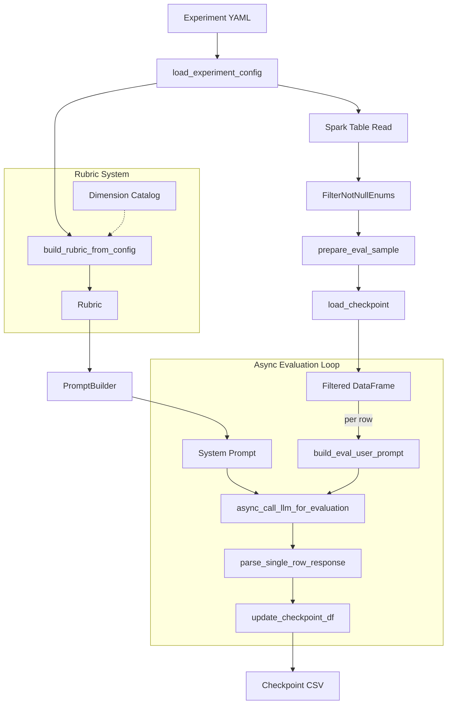

# hg-ds-evals

## Overview

`hg-ds-evals` is an evaluation framework for monitoring and assessing conversational AI systems **without requiring ground truth answers**. Built on the **LLM-as-Judge** paradigm, this library enables systematic quality assessments of production data to discover potential issues, track performance trends, and ensure consistent user experiences.

### Why This Library?

Traditional evaluation approaches rely on labeled datasets with expected answers — a luxury rarely available in production environments. `hg-ds-evals` addresses this gap with **reference-free evaluation**: it assesses response quality using rubric-based criteria judged by LLMs, eliminating the need for ground truth labels. This enables systematic monitoring of real user interactions to surface quality issues before they impact user satisfaction.

### Key Features

| Category | Feature | Description |
|----------|---------|-------------|
| **Evaluation** | Reference-free scoring | Rubric-based LLM-as-Judge — no ground truth needed |
| | Multi-dimensional scoring | Evaluate across multiple criteria (clarity, relevance, completeness, etc.) with weighted aggregation |
| **Architecture** | Modular design | Rubrics, prompts, LLM calls, and pipelines are independent modules, composed flexibly |
| | Programmatic rubrics | Defined with dataclasses; overridable with versioned YAML files for experimentation |
| | Composable evaluations | Mix and match dimensions, metrics, and rubrics per evaluation run |
| | Template-driven prompts | Jinja2 templates decouple prompt engineering from rubric logic |
| **Reliability** | Fault-tolerant execution | Checkpoint-based resumability — interrupted runs continue without re-processing |
| | Version-controlled quality | Rubric versions and evaluation configs are tracked for reproducibility |
| **Scale** | Production-ready | Built on Databricks/Spark with async LLM calls, rate limiting, and batching |

### Use Cases

- Monitor production conversational AI quality across deployments
- Detect model regressions or configuration changes impacting user experience
- Identify topic areas or query patterns where the system underperforms
- Validate system behavior on edge cases and low-frequency scenarios
- Generate quality metrics for dashboards and alerting systems
- A/B test prompt changes or model updates using consistent evaluation criteria


## Directory structure

```
hg-ds-evals/
├── pyproject.toml
├── README.md
├── requirements.txt
│
├── hg_ds_evals/
│   ├── __init__.py
│   │
│   ├── core/                           # Core type definitions
│   │   └── types.py                    # ScoreLevel, Dimension, InputField, OutputSchema
│   │
│   ├── rubrics/                        # Rubric definitions & loading
│   │   ├── base.py                     # Rubric, RubricMetadata classes
│   │   ├── fallback.py                 # Pre-composed fallback rubrics (FALLBACK_RUBRIC, etc.)
│   │   ├── loader.py                   # YAML experiment config → Rubric builder
│   │   └── dimensions/
│   │       └── catalog.py              # Reusable dimension catalog
│   │
│   ├── prompts/                        # Prompt generation
│   │   ├── builder.py                  # PromptBuilder (Jinja2-based, default templates embedded)
│   │   ├── common.py                   # display_prompt(), read_md_file() (notebook utilities)
│   │   └── templates/
│   │       └── fallback/
│   │           ├── prompts.py          # build_eval_user_prompt() (used by api_calls.py)
│   │           ├── system.md.j2        # Fallback-specific system template (optional override)
│   │           └── user.md.j2          # Fallback-specific user template (optional override)
│   │
│   ├── llm/                            # LLM client & API calls
│   │   ├── api_calls.py                # build_api_params(), async_call_llm_for_evaluation()
│   │   └── api_client.py               # get_api_client() (Azure OpenAI)
│   │
│   ├── evals/                          # Evaluation orchestration
│   │   ├── evaluator.py                # async_run_evals() — batch execution with TPM limiting
│   │   ├── parsers.py                  # parse_single_row_response(), display utilities
│   │   └── run_evals.py                # run_experiment() — end-to-end from YAML
│   │
│   ├── common/                         # Shared utilities
│   │   ├── config_api.py               # Azure/Databricks endpoint secrets
│   │   └── utils.py                    # Checkpointing, YAML loading, sample preparation
│   │
│   └── transformers/                   # PySpark data transformers
│       └── events.py                   # FilterNotNullEnums
│
├── experiments/                        # Experiment YAML configs
│   └── fallback/
│       ├── fallback_exp_001_baseline.yaml
│       └── fallback_exp_002_minimal_output.yaml
│
├── tests/
└── examples/
    └── nbs/
```

# Main components of the library

## Pipeline Overview

`run_experiment()` orchestrates the full evaluation flow. The diagram below shows how the components connect:



| Component | Module | Role |
|-----------|--------|------|
| **Rubric** | `rubrics/base.py` | Defines evaluation dimensions, scales, input/output schema |
| **Dimension Catalog** | `rubrics/dimensions/catalog.py` | Reusable dimension definitions |
| **Loader** | `rubrics/loader.py` | Parses experiment YAML → `Rubric` object |
| **PromptBuilder** | `prompts/builder.py` | Renders system/user prompts from rubric via Jinja2 templates |
| **Transformers** | `transformers/events.py` | PySpark filters applied before sampling |
| **API Calls** | `llm/api_calls.py` | Async LLM calls with retry, rate limiting, batching |
| **Parser** | `evals/parsers.py` | Extracts structured JSON scores from LLM response |
| **Checkpoint** | `common/utils.py` | Persists progress row-by-row for resumable runs |
| **Evaluator** | `evals/evaluator.py` | Orchestrates the async evaluation loop |
| **run_experiment** | `evals/run_evals.py` | End-to-end entry point driving all steps above |

## Rubrics & Dimensions

The `hg_ds_evals` library uses a **composition-based rubric system** for defining LLM-as-Judge evaluation criteria. This design enables reusable dimensions, easy customization, and clear versioning.

### Core Concepts

| Concept | Description |
|---------|-------------|
| **ScoreLevel** | Defines what each score (0, 1, 2) means for a dimension |
| **Dimension** | A single evaluation criterion with a scoring scale and weight |
| **InputField** | Defines a data field the LLM judge receives (name, description, required flag) |
| **OutputField** | Defines a field the LLM judge must return (name, type, description) |
| **OutputSchema** | Collection of `OutputField`s defining the full expected JSON response structure |
| **Rubric** | A composition of dimensions with metadata, input fields, output schema, and configuration |
| **RubricMetadata** | Version tracking and identification (id, name, version, description) |

### Using Pre-defined Rubrics

The library includes ready-to-use rubrics like `FALLBACK_RUBRIC`:

```python
from hg_ds_evals.rubrics.fallback import FALLBACK_RUBRIC

rubric = FALLBACK_RUBRIC
print(rubric.dimension_ids)         # ['user_query_clarity', 'topic_relevance', ...]
print(rubric.metadata.version)      # '1.0.0'
print(rubric.total_weight)          # sum of all dimension weights
print(rubric.pass_threshold)        # minimum average score for "pass"
print(rubric.input_field_names)     # fields the LLM judge receives
print(rubric.describe())            # human-readable rubric summary
print(rubric.to_yaml())             # export as YAML (starting point for experiments)
```

### Composing Custom Rubrics from the Dimension Catalog

In `rubrics/dimensions/catalog.py` we have predefined reusable dimensions. Compose your own rubric by selecting relevant dimensions and adjusting their weights:

```python
from hg_ds_evals.rubrics.base import Rubric, RubricMetadata
from hg_ds_evals.rubrics.dimensions.catalog import (
    USER_QUERY_CLARITY,
    TOPIC_RELEVANCE,
    INFORMATION_COMPLETENESS,
)

custom_rubric = Rubric(
    metadata=RubricMetadata(
        id="custom_eval",
        name="Custom Evaluation",
        version="1.0.0"
    ),
    dimensions=(
        USER_QUERY_CLARITY,
        TOPIC_RELEVANCE.with_weight(2.0),     # increase weight
        INFORMATION_COMPLETENESS,
    ),
)
```

### Creating Custom Dimensions

For evaluation criteria not in the catalog, define new dimensions using `Dimension` and `ScoreLevel`:

```python
from hg_ds_evals.core.types import Dimension, ScoreLevel

TONE_APPROPRIATENESS = Dimension(
    id="tone_appropriateness",
    name="Tone Appropriateness",
    description="Is the bot's tone appropriate for the situation?",
    scale=(
        ScoreLevel(score=0, label="bad", description="Inappropriate tone"),
        ScoreLevel(score=1, label="partial", description="Acceptable but could be better"),
        ScoreLevel(score=2, label="good", description="Perfectly appropriate tone"),
    ),
)

# Add to an existing rubric (rubrics are immutable — returns a new instance)
extended_rubric = FALLBACK_RUBRIC.add_dimension(TONE_APPROPRIATENESS)

# Or chain operations: select, adjust weights, add custom
chained_rubric = Rubric(
    metadata=RubricMetadata(id="advanced", name="Advanced Eval", version="1.0.0"),
    dimensions=(
        USER_QUERY_CLARITY.with_weight(1.5),
        TOPIC_RELEVANCE.with_weight(2.0),
        INFORMATION_COMPLETENESS,
    ),
).add_dimension(TONE_APPROPRIATENESS)
```

### Loading Rubrics from Experiment YAML

Instead of composing rubrics in Python, you can define them in experiment YAML files and load them:

```python
from hg_ds_evals.rubrics.loader import load_experiment_rubric

rubric = load_experiment_rubric("experiments/fallback/fallback_exp_001_baseline.yaml")
```

## System and User Prompt Templates with Prompt Builder

The `PromptBuilder` class renders system and user prompts from `Rubric` configurations using Jinja2 templates. This decouples prompt generation from rubric definition — when you add a dimension to a rubric, it automatically appears in the generated prompt without any template changes.

### How Rubric Fields Map to the System Prompt

The system prompt template renders the following sections from the `Rubric` object:

| System Prompt Section | Rubric Field(s) Used | Where to Set |
|---|---|---|
| "You are an expert evaluator for ..." | `metadata.name` | `RubricMetadata(name="...")` |
| "Your Task" | `metadata.description` | `RubricMetadata(description="...")` |
| "Additional Instructions" | `judge_instructions` | `Rubric(judge_instructions="...")` |
| "Inputs You Will Receive" | `input_fields` | `Rubric(input_fields=(...))` |
| "Evaluation Rubrics" | `dimensions` + `scale` | `Rubric(dimensions=(...))` |
| "Output Format" (JSON) | `output_schema.fields` | `Rubric(output_schema=OutputSchema(...))` |

### Usage

```python
from hg_ds_evals.prompts.builder import PromptBuilder
from hg_ds_evals.rubrics.fallback import FALLBACK_RUBRIC

builder = PromptBuilder(rubric=FALLBACK_RUBRIC)

# Build system prompt (instructions + rubric for the LLM judge)
system_prompt = builder.build_system_prompt()

# Build user prompt (populated with actual data for a single evaluation row)
example = {
    "user_query": "What is my card limit?",
    "user_query_contexted": "What is the transaction limit on my debit card?",
    "conversation_history": "",
    "selected_enum_name": "CARDS@LIMITS",
    "selected_enum_description": "Information about card limits...",
    "bot_answer": "I'm sorry, I don't have that information.",
}
user_prompt = builder.build_user_prompt(example)

# Validate that an example contains all required input fields
is_valid, errors = builder.validate_example(example)
```

### Custom Templates

`PromptBuilder` accepts optional template overrides:

| Parameter | Default | Purpose |
|---|---|---|
| `rubric` | *(required)* | The `Rubric` instance that feeds all template variables |
| `system_template_path` | `None` (uses embedded default) | Path to a custom `.j2` system template |
| `user_template_path` | `None` (uses embedded default) | Path to a custom `.j2` user template |
| `templates_dir` | `None` | Base directory for Jinja2 `FileSystemLoader` |


## LLM Calls

The evaluation engine uses **async API calls** to an LLM judge (Azure OpenAI). Key details:

- **Async execution**: Each evaluation row is sent as a separate API call using `asyncio`, enabling concurrent processing within configurable limits
- **Concurrency control**: An `asyncio.Semaphore` limits the number of simultaneous API calls (`max_concurrent_calls` in config)
- **TPM rate limiting**: After each batch, the engine calculates token usage and throttles requests to stay within the model's tokens-per-minute (TPM) limit
- **Retry with backoff**: Uses `tenacity` for automatic retries on `RateLimitError` and `APITimeoutError` with exponential backoff (2 attempts, 4-70s wait)
- **Model-specific params**: Automatically adjusts API parameters per model — e.g., `temperature` for GPT-4o/4.1, `reasoning.effort` for GPT-5/5-nano
- **Prompt construction**: For each row, the system prompt (built from the rubric) is paired with a user prompt (populated from the row data), and sent as a `system` + `user` message pair
- **Structured JSON output**: The LLM judge returns a JSON response containing `rubric_scores` (per-dimension score + reasoning) plus any additional fields defined in the `OutputSchema`

### API Flow per Row

```
Row data → build_eval_user_prompt(row) → build_api_params(system, user, config) → client.responses.create(**params) → JSON response
```


## Example Workflows

A notebook that showcases the workflow can be found at the following [link](https://adb-2458546570334888.8.azuredatabricks.net/editor/notebooks/1259742922765517?o=2458546570334888#command/6938958005116096).

### Workflow 1: Full Run from Experiment YAML (Recommended)

The simplest way to run evaluations. A single YAML file defines everything: rubric, model, dataset, and paths. One line of code executes the full pipeline.

```python
from hg_ds_evals.evals.run_evals import run_experiment

# One line is all you need — config drives everything
results, metrics = await run_experiment("experiments/fallback/fallback_exp_001_baseline.yaml")
```

Under the hood, `run_experiment()` performs these 7 steps automatically:
1. **Load config** — parses the experiment YAML and resolves the system prompt from the rubric definition
2. **Load input data** — reads the Spark table specified in `dataset.input_dataset`
3. **Filter data** — applies PySpark transformers (e.g., `FilterNotNullEnums`) to remove invalid rows
4. **Prepare eval sample** — converts to pandas, limits to `test_num_rows`, generates a checkpoint filename
5. **Load checkpoints** — checks for previously processed rows so interrupted runs resume automatically
6. **Setup API client** — creates an async Azure OpenAI client with the specified model deployment
7. **Run evaluations** — sends async LLM calls in batches with rate limiting, saves results incrementally to the checkpoint CSV

Results are saved incrementally to the checkpoint file, so even if a run is interrupted you don't lose progress.

### Workflow 2: Step-by-Step Evaluation

Useful for debugging, inspecting intermediate results, or customizing individual steps.

```python
from pyspark.ml import Pipeline
from pyspark.sql import SparkSession
from ds_common.config.config import HGCol as C, HGTbl as T
from hg_ds_evals.rubrics.loader import load_experiment_config, build_rubric_from_config
from hg_ds_evals.prompts.builder import PromptBuilder
from hg_ds_evals.llm.api_client import get_api_client
from hg_ds_evals.transformers.events import FilterNotNullEnums
from hg_ds_evals.common.utils import (
    load_checkpoint,
    filter_df_with_checkpoints,
    prepare_eval_sample,
)
from hg_ds_evals.evals.evaluator import async_run_evals

# Step 1: Load experiment config — defines dataset, model, paths, rubric
config = load_experiment_config("experiments/fallback/fallback_exp_001_baseline.yaml")

# Step 2: Build rubric and system prompt from the config
rubric = build_rubric_from_config(config)
builder = PromptBuilder(rubric=rubric)
system_prompt = builder.build_system_prompt()

# Step 3: Load data from Spark and apply filtering pipeline
spark = SparkSession.builder.getOrCreate()
input_data = spark.read.table(f"{T.DBX_CATALOG}.{T.DBX_SCHEMA_PRIVATE}.{config['dataset']['input_dataset']}")
dp_pipeline = Pipeline(stages=[FilterNotNullEnums()])
df = dp_pipeline.fit(input_data).transform(input_data)

# Step 4: Sample rows for evaluation and select eval columns
df_sample, file_name_eval = prepare_eval_sample(
    df=df,
    evals_name=config["experiment"]["name"],
    reasoning_effort=config["model"]["reasoning_effort"],
    num_rows=config["dataset"]["test_num_rows"],
)
df_eval = df_sample[config["dataset"]["eval_columns"]].copy()

# Step 5: Load checkpoint for resumability — skip already-processed rows
ckp_df, ckp_path = load_checkpoint(
    checkpoint_file_name=file_name_eval,
    checkpoint_dir=config["paths"].get("checkpoint_dir", "checkpoints"),
)
df_eval = filter_df_with_checkpoints(df_eval, ckp_df)

# Step 6: Create async API client
client = get_api_client(
    model_deployment_name=config["model"]["model_deployment_name"],
    api_provider=config["model"]["api_provider"],
)

# Step 7: Run the evaluation — async LLM calls with batching and rate limiting
results, metrics = await async_run_evals(
    df=df_eval,
    system_prompt=system_prompt,
    client=client,
    config=config,
    checkpoint_path=ckp_path,
)
```

### Workflow 3: Comparing Experiment Variants

Load two experiment YAMLs and compare their rubric configurations or generated prompts:

```python
from hg_ds_evals.rubrics.loader import load_experiment_rubric
from hg_ds_evals.prompts.builder import PromptBuilder

rubric_a = load_experiment_rubric("experiments/fallback/fallback_exp_001_baseline.yaml")
rubric_b = load_experiment_rubric("experiments/fallback/fallback_exp_002_minimal_output.yaml")

# Compare dimensions and output fields
print(f"A dimensions: {rubric_a.dimension_ids}")
print(f"B dimensions: {rubric_b.dimension_ids}")

# Compare generated prompts
prompt_a = PromptBuilder(rubric=rubric_a).build_system_prompt()
prompt_b = PromptBuilder(rubric=rubric_b).build_system_prompt()
print(f"Prompt A: {len(prompt_a)} chars | Prompt B: {len(prompt_b)} chars")
```


# Testing

All unit tests are defined in `tests/` directory and are executed on Databricks using Python notebooks, which are saved in `examples/nbs/tests/`.
